# Job GS-070 — CuppaPug Hackney: Bespoke Storage Build Pack

Back-bar storage, front display base & bench, and TV-wall shelving for Aaron C. at CuppaPug, Hackney. This pack collects the full material list, cut list, drawings, plan of action and build sequence into one working reference — cross-checked against Quote GS-070, Survey Drawing Rev B and Front Area Concept Rev A.

**Working document — not for client circulation.** Cross-reference against Quote GS-070 and drawings Rev B / Rev A before ordering or cutting.

## Job summary

| | |
|---|---|
| Client | Aaron C. · CuppaPug |
| Quote value | £3,500 |
| Deposit / balance | £1,400 / £2,100 |
| Materials allowance | £1,050 ±10% |
| Survey date | 21 Aug 2026 |
| Pack prepared | 22 Aug 2026 |
| Build windows | 2× Mon–Wed closed days |
| Working method | Fabricated & finish-coated in workshop; site days for fit only |

**Read this first.** Worktop height, the gauge methodology, TV-wall shelf height, spirit-bottle clearance, hinge type and quantity, the blender-bay approach, the cupboard layout, the full appliance roster, the ventilation-allowance decision, Shelf 2's design (received, not yet transcribed), the bench/base junction method, TV bracket position and the digital-menu question are all settled as of 30 Aug. Bench height, Zone 2 doors-vs-open, and the two IKEA-cupboard-width questions remain open — see the walkthrough plan below. The underside conflict is now resolved at 885mm (see Key datum), which reopens the cooler clearance problem as a hard blocker, not just a tight fit. The cut list flags every component ready/hold/blocked individually — see the Questions list before releasing anything to the saw.

**Key datum, confirmed on site 30 Aug:** worktop 920 finished, underside of bar **885mm** (a 35mm top). This is the fourth figure given for the underside (885 -> 880 -> 895 -> 885) but the first taken as a direct site measurement rather than a sketch or gauge reading, so it now supersedes the “895 final” recorded on 29 Aug. All covered faces and below-worktop carcasses are cut to 885.

**Open risk, now critical — the coolers do not physically fit.** Confirmed underside is 885mm; the Adexa coolers measure 893mm. That's -8mm — not a tight clearance, an actual 8mm shortfall. These are 86kg freestanding units on castors; at 885mm they cannot be rolled into the bay at all, let alone serviced. This blocks run A's below-worktop carcasses and cooler openings entirely until one of the four remedies in the Appliance Schedule is chosen — it is no longer safe to proceed on the assumption a workaround will be found on the day.

**Resolved, 30 Aug — the underside is 885mm, confirmed on site.** The Side Profile sketch's 885mm reading (flagged 29 Aug as unreconciled against the “895 final”) turned out to be the correct one. Question 28 is now closed. See the Key datum and Open risk notes above for what this changes.

**Correction, 30 Aug — "Covered face, run A" and "Covered face, run B" were never real pieces and have been retired.** Both sat in the Area 1 cut list as continuous ready-to-cut panels (4100mm and 4300mm) — a leftover from the original rough elevation spec, never reconciled against the actual layout once the sketches nailed it down. The real construction on both runs is identical: cupboard units either side of each appliance, appliance sitting bare in the open recess, no panel over or around it. Coverage is the cupboard doors plus the return panel and Run A's corner detail — see Area 1 in the Cut List.

## Site reference — 5 photos (Aaron's annotated walkthrough)

Site photos of the existing back-bar run, annotated by Aaron in yellow to mark zones, clearances and open questions. These are the primary reference for the Zone 1–5 breakdown used throughout this pack. Four of the five have now been reviewed directly (below); the fifth has not yet been supplied.

**Zone 4 & 5 — computer space and blenders**

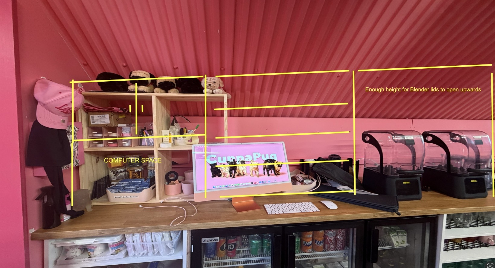

- Confirms the physical layout left to right: the existing pine shelving unit (bottom shelf holds the iMac, labelled "COMPUTER SPACE"; shelves above hold merch and coffee sachets) — then a wall bay with a yellow grid marked across it — then the two Buffalo-branded blenders, annotated "Enough height for Blender lids to open upwards."
- **The gridded wall bay between the computer shelving and the blenders is the same run of open shelving Aaron's 29 Aug notes described** (see Site Sketches Update above) — this photo now confirms its position by sight rather than by description alone. It sits directly above the existing pine unit and to the left of the blenders, matching "between the computer cupboards and the blender bay."
- Blender clearance is annotated but not dimensioned in the photo — Question 24's decision (build open to the ceiling, no shelf yet) still stands; a hard number for the lid-swing height is still not given here.

**Zone 1b — spirit run**

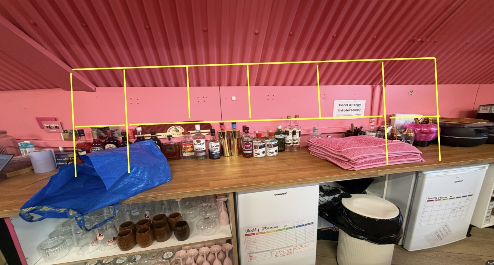

- Shows the spirits & bar-tool shelf (Campari, Bacardi, Sailor Jerry, Malibu, jiggers, Smirnoff, Gordon's, bar towels) with a yellow grid marking roughly six bays across the run — consistent with the roof-kink box-storage sequence in Zone 1, but the grid lines are a rough guide, not a dimensioned bay split; Question 25's answer (measure fridges, let cupboards absorb the remainder) still governs the real split below worktop.
- A large IKEA "FRAKTA" tote bag sits on the counter in this photo — worth checking with Aaron whether it's carrying one of the delivered IKEA cupboard units referenced in the Site Sketches Update, or just general shopping.

**Zone 3 — glass storage**

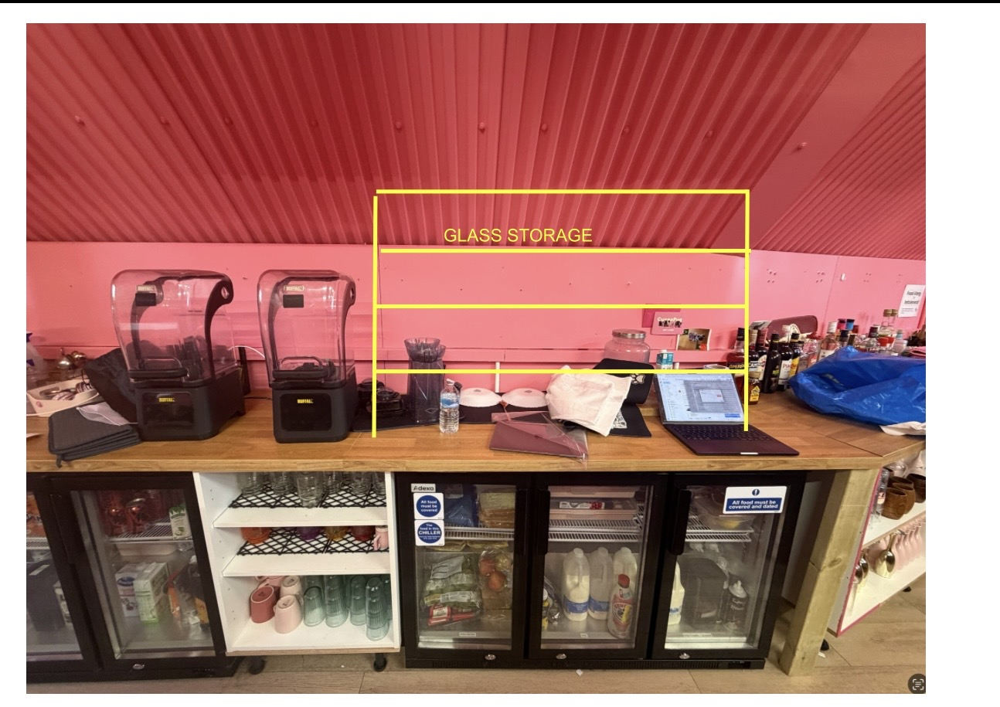

- Visually confirms the existing text: open shelving above three under-counter drinks fridges, labelled "GLASS STORAGE." No new dimensions or changes — matches the pack as written.

**Zone 2 — appliance run**

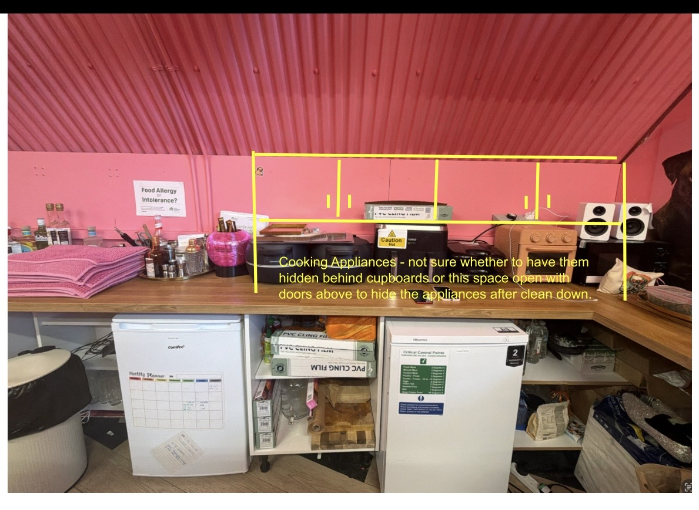

- Confirms the physical appliances: a toastie machine, an air fryer, a boxed roll of cling film, another hot appliance, a toaster, and a Bluetooth speaker — sitting above the COMFEE' and Hisense freezers already logged in the Appliance Schedule (both units visible and labelled in this photo). The worktop's right-angle turn into the cocktail-section wraparound is also visible here.
- **Aaron's own annotation on this photo answers part of Question 1 with a proposed direction, not yet a final decision:** *"Cooking Appliances - not sure whether to have them hidden behind cupboards or this space open with doors above to hide the appliances after clean down."* That's a third option beyond a straight doors-vs-open choice — leave the appliances on open worktop for daily use, with a separate door or cover above that closes over the space once they're cleaned down at close. Worth putting back to Aaron as a concrete proposal to confirm, rather than leaving Question 1 as a blank open/closed choice.

- **Zone 1a · Box storage** — Merch + dog-portrait end of the roof-kink run. Needs height for standing spirit bottles as well as merch.
- **Zone 1b · Spirit run** — Same box-structure run continuing over the spirits & bar-tool shelf; build as one sequence with Zone 1a.
- **Zone 2 · Appliance run** — Toastie machine, air fryer, toaster, microwave, speaker. Doors vs. open shelving — still unconfirmed; see Aaron's own note above for a proposed compromise.
- **Zone 3 · Glass storage** — Open shelving above the drinks fridges — confirmed, sized to tumblers, jars and flute glasses below.
- **Zone 4 & 5 · Computer + blender** — Existing pine cubby (build around it) and two blenders with lids that need clearance to open upward; no shelf above. The open-shelf run between them is now photo-confirmed — see above.

## Site sketches update — 29 Aug 2026 (GraySparks' own working sketches + notes)

Three hand-drawn working sketches (GraySparks' own, not Aaron's) and the notes attached to them, made after the original survey. These sharpen the below-worktop cupboard detail and the above-worktop left-hand run, and raise one new figure conflict. Read alongside the Elevations and Cut List sections below — they don't replace those, they add site-level detail on top.

**Run A (4100, left) — below worktop**

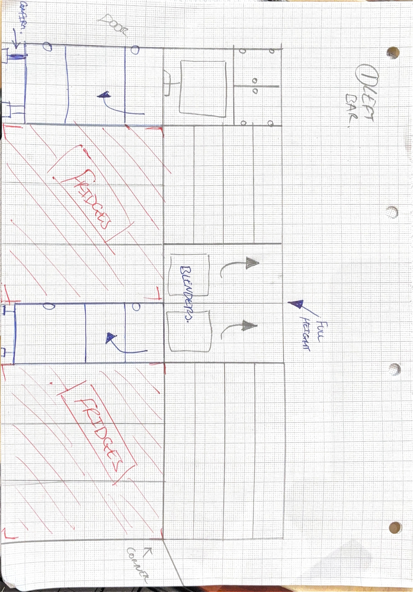

- Confirms the physical order: cupboard · coolers (Adexa, hatched "FRIDGES") · cupboard · blenders (marked "full height") · coolers · corner — consistent with the cut list's cupboard–cooler–cupboard–cooler run.
- **New detail: the two cupboards are existing/purchased IKEA carcass units, not built-from-scratch joinery.** Each needs a plinth face added to cover its legs. This changes the cupboard cut-list items below from "carcass + doors" to "plinth face + door treatment on an IKEA shell."
- **The two IKEA units are not equal widths.** The attached notes are explicit: "the one on the left looks slightly wider, and the one between the two fridges looks slightly narrower." This supersedes the derived even 715 / 715 split in the Bay Arithmetic table — the two cupboard bays need to be measured individually, not assumed equal.
- Sketch marks one unit "CONFIRM" against a door detail at the far left end — width still to be nailed down before the plinth face is cut.

**Run B (4300, right) — below worktop**

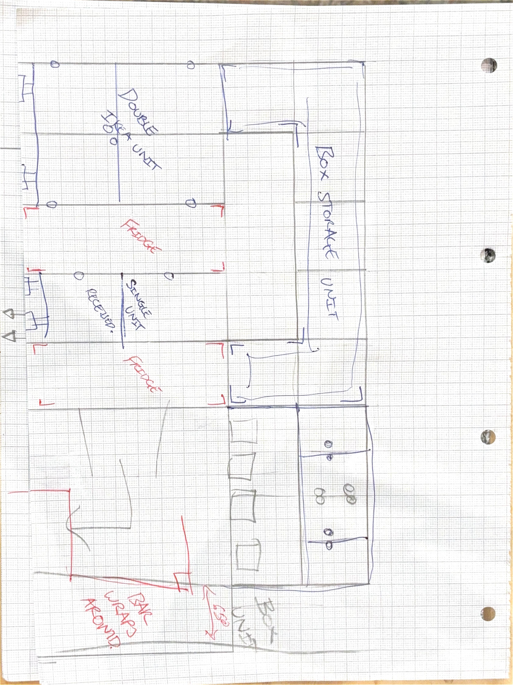

- Shows the same IKEA-carcass approach on run B: a double IKEA unit (annotated close to 1600mm — in line with the 1594 derived figure) and a single IKEA unit, with the two freezers between them.
- **The single IKEA unit is annotated "received"** — i.e. already delivered stock. Once it's unpacked, measure its actual width and use that in place of the derived 797mm single-cupboard figure, rather than assuming the manufacturer's nominal size.
- A rough plan at the bottom repeats the cocktail-section note ("bar wraps around") — still not a substitute for the dimensioned measurement Question 14 asks for.

**Side profile — depth**

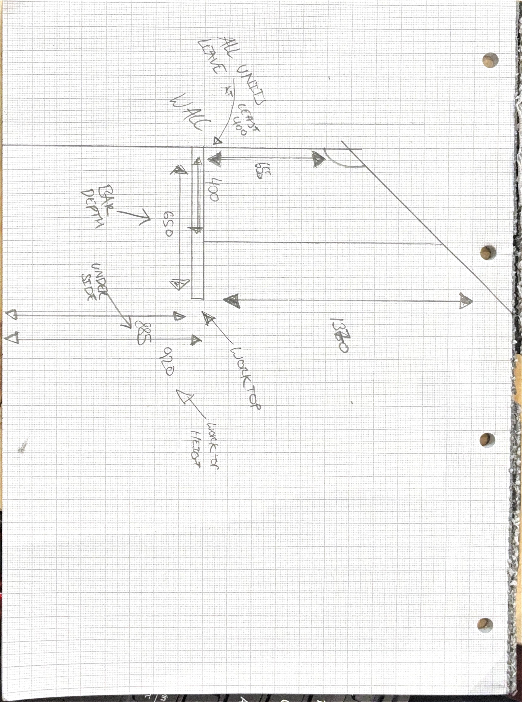

- Confirms 650mm bar/counter depth and a 400mm depth note for the above-worktop box structure ("Shelf 1"), labelled "ALL UNITS LEAVE 400."
- **Sets a working ceiling on Shelf 1 depth, not just a starting assumption.** The accompanying notes: "there needs to be at least 400mm [of unit depth]. That leaves at least 250mm of workspace where the cupboards are" — i.e. 650mm counter depth − 400mm of overhead unit ≈ 250mm clear counter workspace. 400mm is close to the practical maximum before the counter workspace gets too tight, not just a placeholder figure. Still needs sign-off as an exact number (Question 9), but it's now a bounded range rather than an open guess.
- **Correctly flagged the underside as 885, not 895** — this sketch's reading is the one that was confirmed on site 30 Aug (Question 28).

**Above-worktop, left-hand run (from GraySparks' own working notes — no matching sketch supplied)**

- Computer nook: sized for a 21″ MacBook/iMac, with two storage cupboards above it, **doors opening outward** (not the inward-swinging soft-close overlay style already specified for the bar-face cupboards — confirm this is a deliberate difference before ordering hinges for this section).
- Next to the computer nook: **a new run of four open storage shelves**, spacing matched to the Zone 3 glass storage on the right-hand side. This is a shelf position not previously listed in the Zone 1–5 breakdown — treat it as an addition between the computer cupboards and the blender bay.
- Blender bay: full height, no shelf for now — matches the Zone 5 decision already recorded (Question 24). These notes give the same reasoning: leave it open until real lid-swing clearance is visible, then decide on a shelf.

**CuppaPug Site Sheet (printable Q&A summary)** — a one-page print version of the Questions & Confirmations list below was also supplied as a PDF; its content matches this pack and isn't reproduced separately here.

## Aaron's WhatsApp measurements — 30 Aug 2026

Five photos sent by Aaron in response to the follow-up message (Questions 26, 27, 30). Reproduced here for reference; readings quoted below are estimates, not confirmed cutting dimensions — see the Questions themselves for what's still open.

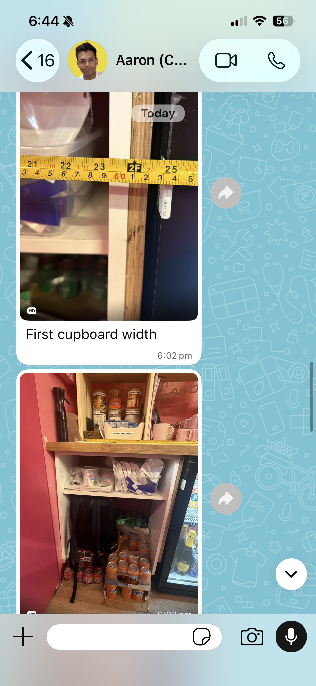
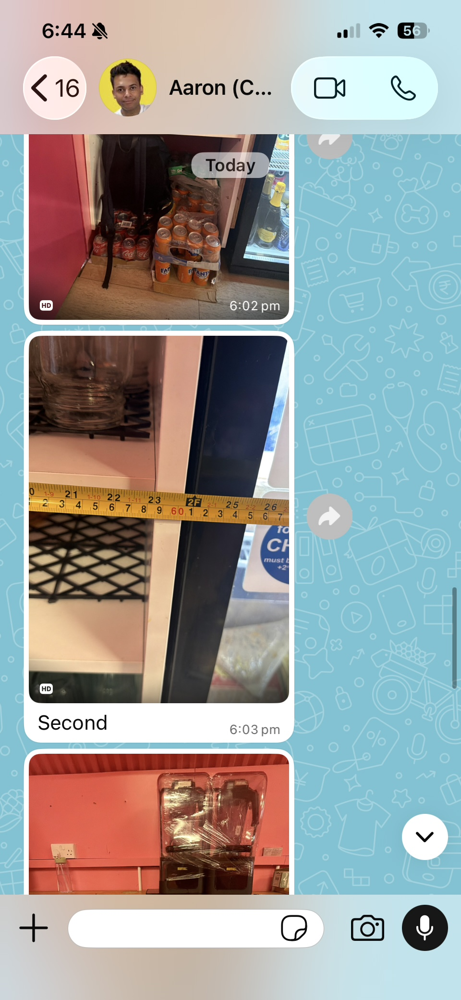
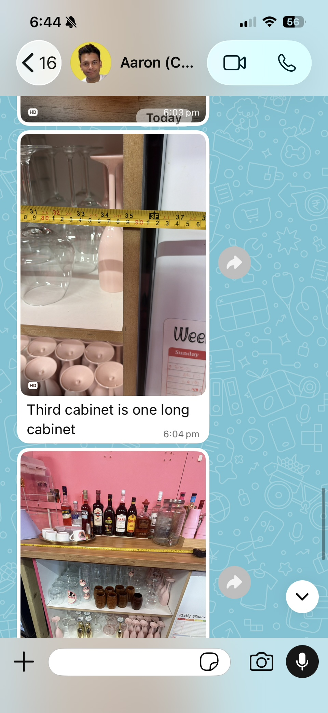
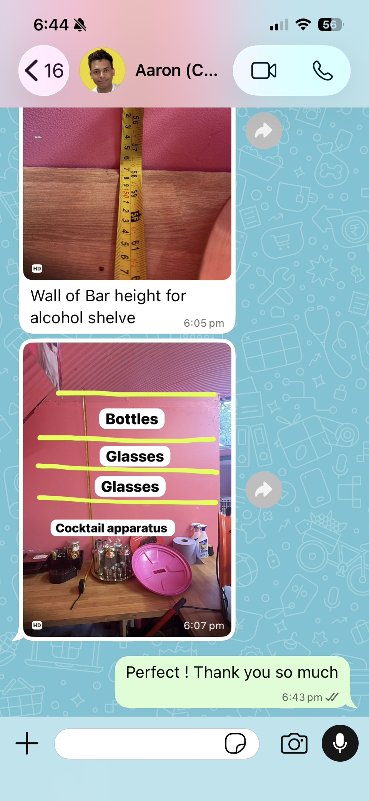
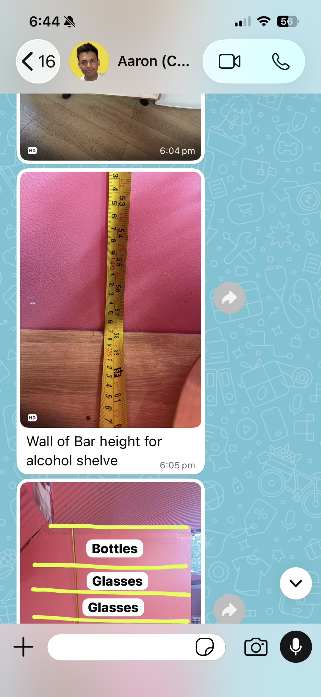

- "First cupboard width" and "Second" — the two Run A cupboard widths (Question 26). Both read close to the 60cm mark, closer in size to each other than the 80/60cm working hypothesis assumed — needs a precise confirmed number before cutting either plinth face.
- "Third cabinet is one long cabinet" — confirms the Run B "double" unit is genuinely one cabinet, not two 80cm units side by side (Question 27). Retires that hypothesis. Exact width still needed.
- "Wall of Bar height for alcohol shelve" — a vertical tape reading for the far-end wall height (Question 30), but the frame shown only covers a mid-section of the tape, not a clear total.
- Annotated layout photo — settles the shelf order top to bottom as Bottles → Glasses → Glasses → Cocktail apparatus (Question 30), reversing the original assumption that the bottle row was at the bottom.

## Elevations & survey drawings (redrawn from Rev B & Rev A)

Schematic, not to scale — measured verticals govern over calculated angles. Solid black lines are confirmed dimensions; dashed pink lines are still TBC and must be locked on site before cutting.

### Back-bar — overall elevation (unfolded) — Ref: Rev B · Build Pack §1

- Worktop is the datum. Corner is 156.7° internal, confirmed.
- Covered face (final) height: 885 (confirmed on site 30 Aug, supersedes 895).
- Shelf 1 at 655 above worktop, depth 400 (TBC).
- Shelf 2 above Shelf 1 at ≈330 (TBC), depth 300 (TBC).
- Roof-kink angle: 142.3° gauge / ≈137.7° calculated — verticals govern, reconcile on site.
- 1370 governs.
- Total run: 4100 + 4300 = 8.4m, confirmed. Worktop 920 finished / 885 underside (confirmed 30 Aug).
- Zones along the run: 1 Box storage + spirits (roof-kink) · 2 Appliances (doors TBC) · 3 Glass storage · 4 Computer space · 5 Blender bay (no shelf). Individual bay widths are TBC; only the total run is confirmed.

### Below worktop — cupboard & appliance layout (widths derived from Appliance Schedule)

Worktop: 920 finished / 885 underside (confirmed 30 Aug).

**Run A — 4100 (left, to corner):** cupboard 715 · Adexa 3-door 1335×510 · cupboard 715 · Adexa 3-door 1335×510 · corner piece (?).
4100 − (2 × 1335 cooler) = 1430 ÷ 2 cupboards = 715 each.

**Run B — 4300 (right):** double 553 · COM · CB · Hisense 560 · then cupboard → end section (deferred).
4300 − 1113 = 3187 → 797 singles / 1594 double.

Shaded = appliance opening (no carcass) · outlined = cupboard carcass · dashed = corner piece, detail TBC. Widths derived from manufacturer specs, zero filler allowance. Run A assumes "three fridges" = one 3-door cooler — confirmed. Not to scale.

**Update — cupboards are IKEA carcasses, not built joinery.** Per the Site Sketches Update above, every cupboard position on both runs is an existing/purchased IKEA unit dressed with a plinth face to cover its legs, not a from-scratch carcass. The 715/715 (run A) and 797/1594 (run B) figures above remain the design starting point, but run A's two cupboards are confirmed *not* equal width on site — measure each individually — and run B's single IKEA unit is already delivered and should be measured directly rather than assumed.

**Working hypothesis — most likely real IKEA sizes (30 Aug, unconfirmed — tape-check on site, do not cut to this).** IKEA base-cabinet ranges (the current METOD system, almost certainly what's on site) come in a small fixed set of sizes, so the derived even-split figures above were never going to be the real widths. Reasoning back from the numbers we do have:

- **Height:** METOD's 80cm-tall body sits on adjustable legs (roughly 60–100mm of travel). 800 + 85mm of leg ≈ 885mm — consistent with the confirmed underside (Question 28, resolved 30 Aug at 885mm). Worth checking whether any individual unit's legs need winding down to match once they're all in place.
- **Depth:** standard body depth is 60cm; a worktop typically overhangs the cabinet front a few cm for door clearance — 600 + ~50mm ≈ 650mm, matching the counter depth in the Side Profile sketch.
- **Run B widths:** the derived 797mm single is almost certainly a real **80cm (800mm)** cabinet, and the ≈1600mm "double" is most likely just **two 80cm cabinets side by side** (2 × 800 = 1600mm) — which also explains the "double" naming.
- **Run A widths:** for the uneven pair to fit within 1430mm with one visibly wider than the other, the best fit is **80cm (wider, left end) + 60cm (narrower, between the coolers) = 1400mm**, leaving ~30mm slack across the run for scribe/filler — normal, not an error.

Bring a tape (and the hex key for the cabinet legs) to check this against the real units rather than measuring blind — but treat 80cm/60cm as the expected answer, not a surprise.

### Back-bar — plan & section (Rev B), survey 21 Aug 2026

**Plan view:** counter (existing worktop stays), 650 depth, 4100 wall run A, 4300 wall run B, R/A return, 630 to final wall, 156.7° internal (203.3° gauged, wall side). Service side: open, no panels — kegs/CO₂ stay, legs realigned only.

**Section — side profile** (measured heights govern): floor not surveyed (measure next visit); roof slope 142.3° gauge / ≈137.7° calculated; Shelf 1 @ 655, depth 400 TBC; Shelf 2 @ ≈330 TBC, depth 300 TBC, ref. point TBC; 1370 governs; 650 counter depth.

### Zone 1 detail — box-structure storage, roof-kink run

Feature stepped shelf follows the roof-kink line — cut to site angle, do not pre-cut.

- Row 3 (top) — bottles, 350mm clear (derived) — corrected 30 Aug, was assumed bottom.
- Row 2 (middle) — glasses, height TBC.
- Row 1 (bottom) — glasses, height TBC.
- Below the bays, at counter level — cocktail apparatus (not a shelf).
- Bay 1 width — TBC (part of the 4100mm leg, confirm split with Bay 2).

**Two separate box units, not one (30 Aug).** Zone 1a (merch/dog-portrait end) and Zone 1b (the six-bay spirit run) are two distinct box-structure units built as one sequence, not a single continuous carcass. Zone 1a's height can be inferred from the roof-slope profile that's already established across the rest of the bar — working estimate **≈2–2.5m at that end**, to be confirmed on site once the roof-slope angle itself is settled (Question 8). Treat this as a planning figure, not a cutting dimension.

**Batch-cutting strategy (30 Aug) — dividers and shelves standardised to 400mm.** Both units' depth is capped at 400mm for the same reason Shelf 1's depth is: any deeper and it starts eating into the 250mm of clear counter workspace established from the 650mm bar depth. Since every divider and shelf across both units shares that same 400mm width, cut them as long lengths at 400mm and batch-divide down to each bay's actual size, rather than measuring and cutting each divider or shelf individually — one saw setup for the whole run instead of one-off cuts.

### Front display & TV wall (Rev A), survey 21 Aug 2026 — rough, for concept & pricing

**Plan — base unit:** 3300 base run, 400 deep, 230 high (retained); 710 @ 224.8° turn (resolve 224.6° vs 224.8°); 1700 bench zone, raise 230 → ≈1000 (TBC).

**Elevation — TV wall:** base 230 (display) · bench 1000 beyond this wall. TV **50″, confirmed by Aaron** (supersedes the ≈65–70″ placeholder), centred. Bays ≈800, adjustable, no backs. Top shelf at roof-kink, height TBC (measure this wall, don't reuse the bar's 655).

**Update (30 Aug):** the digital menu and the TV are the same screen — there's no separate menu display to position, which is why it can sit lower than a typical TV-viewing height (Question 6). Bracket position: vertically centred at the midpoint of the height from the floor to the angled ceiling at that specific point on the wall (Question 5) — bracket depth still depends on the hardware chosen.

## Appliance schedule (manufacturer figures, 3 models)

External dimensions from manufacturer spec, not site-measured. Every opening below the worktop is sized off these — check the model plate on each unit against this table before cutting, particularly the cooler, which has two variants at different heights.

| Model | Type | W | D | H | Opening required | Clearance under 885 (confirmed 30 Aug) |
|---|---|---|---|---|---|---|
| Adexa BC03PP ×2 — 312L back-bar cooler, 3 hinged glass doors, 86kg, run A | Cooler, +2 to +8°C | 1335 | 510 | 893 measured / 895 spec | Vent clearance TBC — commercial unit | **-8mm — does not fit** |
| Hisense FV105D4BW21 — 85L, run B | Freezer | 560 | 575 | 845 | Vent clearance — see manual | 40mm — workable |
| COMFEE' RCU83WH2(E) — 88L, run B | Freezer | 553 | 574 | 845 | Vent clearance — see manual | 40mm — workable |

**Retailers round these figures differently — get the manual before cutting.** The FV105D4BW21 is listed as 845×555×575 by some retailers and 850×560×580 by others — a 5mm spread from inconsistent cm rounding. Not fatal, because openings are cut to the recess figure which absorbs it, but no retailer page is a cutting source. Pull the installation manual for each model and work off the manufacturer's recess drawing.

**Correction — the "585 recess" figure in the previous revision was wrong.** An earlier revision said the Hisense needed a 585 × 595 × 875 recess. That figure was actually the packed carton size (580 × 596 × 873 per the manufacturer sheet), picked up from a search result that mislabelled it. It is not an installation dimension — do not size openings from it.

These are all freestanding units, so there is no manufacturer built-in recess spec at all. **Decision (30 Aug): skip the ventilation/handling allowance.** Openings are cut to the cabinet widths directly (553mm COMFEE', 560mm Hisense, and the run A cupboard widths once measured) rather than adding a manual-derived clearance margin. This is the builder's explicit call for this job — it trades some rear-clearance/servicing margin for simplicity — and is separate from the cooler height-clearance problem below, which is unaffected and still critical.

### The cooler bays need a real clearance decision — confirmed 885 makes this worse, not better

Bar underside confirmed 885, cooler 893. **The cooler does not fit — it's 8mm too tall, not 2mm too tight.** This was already a problem at the old "895 final" figure; at the now-confirmed 885 it's a hard block, not a servicing inconvenience:

- **It has to go in.** 86kg on castors, rolled into a 1335mm opening 8mm shorter than the unit. It will not go in at all, dip in the floor or not.
- **Floors aren't flat.** Even if 885 were somehow stretched to 893 exactly, a normal floor dip would still jam it. There is no scenario where 885 and 893 coexist without a fix.
- **Servicing.** Irrelevant until installation itself is solved.
- **The worktop isn't a datum.** 885 is now a direct site measurement, not a design intent — more reliable than the old 895, but it still isn't guaranteed dead straight over 4100mm.

**Recommendation, now more urgent:** target 20–25mm clear above the cooler — a 913–918mm opening. From a confirmed 885mm baseline that's a 28–33mm raise needed, bigger than the 20–25mm raise this recommendation originally called for from 895. That needs a local worktop raise over the two cooler bays, a whole-bar raise, or a cooler swap (Option 4 below) — this cannot be left for site-day improvisation.

### Cooler bay — the four ways out, cheapest first

| Option | What it costs | Knock-on |
|---|---|---|
| 1. Drop the coolers on their feet (check castors/adjustable feet first) | Nothing, if they have adjustable feet or removable castors | Possibly already done — the builder believes the castors/feet were already sorted before this job started, which would mean the measured 893mm already reflects the lowest achievable height and this option is exhausted, not fresh. Verify on site rather than assume it's untried. |
| 2. Local worktop raise over the two cooler bays only | Joinery time; a stepped worktop line | Visible step in the bar top — needs Aaron's sign-off on the look |
| 3. Raise the whole bar to 915–920 underside | Covered faces recut; everything worktop-referenced shifts | Shelf 1 at 655 above worktop moves with it; front bench relationship changes |
| 4. Swap to BC03PP85, 850mm, same 1335×510 footprint | Two new coolers — client purchase | 45mm clear, no joinery change at all. Loses 12L per unit. |

### Appliance roster is now closed — three models, four units

Run A: 2 × Adexa BC03PP 3-door coolers. Run B: 1 × COMFEE' RCU83WH2 + 1 × Hisense FV105D4BW21. The Hisense RL170 larder fridge is out of scope and has been removed from this pack.

Run B therefore carries two appliances, not the three the original layout implied — so the third appliance position becomes a cupboard, giving double · freezer · cupboard · freezer · cupboard. Note both run B units are freezers; there is no fridge on that run, which is worth confirming is intended.

### Bay arithmetic — cabinet widths only, no ventilation allowance included

| Run & reading | Appliance width | Left for cupboards | Cupboard width | Status |
|---|---|---|---|---|
| Run A — 2 × Adexa 3-door (4100 · cupb · cooler · cupb · cooler) | 2 × 1335 = 2670 | 1430 | 715 each (2 cupboards) | confirmed layout |
| Run B — COMFEE' + FV105 (4300 · double · frz · cupb · frz · cupb) | 553 + 560 = 1113 | 3187 | 797 single / 1594 double | confirmed layout |

All figures derived from manufacturer cabinet widths. As of 30 Aug, no ventilation allowance is being added on top of these — see the decision above — so these widths (minus the run A even-split correction) are closer to final than a placeholder.

## Full material list (ordering reference)

Estimates for ordering purposes — confirm exact sheet count once Shelf 2 and the TV-wall bays are sized. Priced at cost against the £1,050 materials allowance in Quote GS-070; variance beyond ±10% is notified before purchase.

**Sheet goods & timber**

| Material | Est. qty | Notes |
|---|---|---|
| 18mm birch ply (carcass / panels) | 6–8 sheets | Confirm exact once Shelf 2 and TV bays sized |
| Solid oak / ash lipping | ≈25m | Faces, shelf edges, return |
| 44×44 PAR softwood (framing / battens) | ≈20m | Backing frames, bench structure |

**Hardware & fixings**

| Material | Est. qty | Notes |
|---|---|---|
| Steel shelf brackets / bracket stock | as req. | Shelf 1 both runs + TV bays |
| Wall fixings — board substrate | as req. | Most of both walls |
| Wall fixings — masonry (brick pier) | as req. | TV wall, left end only |
| Soft-close hinges, full overlay | 20 in stock | Confirmed: full overlay (not half), 35mm cup hole per hinge. Verify 20 covers the final door count once cupboard bay widths are set — order more if short |
| Bread-bin cover mechanism | TBC qty | Do not order — hinge type confirmed, but the cover mechanism itself is still open |
| Standard cabinet hinges / fittings | as req. | General |
| Replacement cabinet feet | as req. | For retained 230mm base sections |

**Finish**

| Material | Est. qty | Notes |
|---|---|---|
| Sealant / varnish, hard-wearing | ≈5–6L | 2–3 coats, all new joinery |
| Colour-matched pink paint | ≈2–3L | Match house pink where required |
| Sandpaper, various grits | as req. | |

**Consumables**

| Material | Est. qty | Notes |
|---|---|---|
| Blades (saw / router) | spares | |
| Paint brushes & rollers | set | |
| Wood filler | 1–2 tubs | |
| Clamps | check stock | Corner mitre glue-ups need extra |

## Cut list (workshop reference)

Status key: **ready** — confirmed dims, cut now · **hold** — one figure or decision missing · **blocked** — not measured / design not agreed, do not cut · **template only** — make the template, not the panel.

### Area 1 — back bar

**Correction (30 Aug) — there is no continuous covered face panel on either run.** The original "Covered face, run A" and "Covered face, run B" entries were a rough leftover from the initial elevation spec, never reconciled against the actual layout your sketches established. The real construction on *both* runs is identical: cupboard units built either side of each appliance, with the appliance itself sitting bare in the open recess — no panel over or around it, doors/fronts fully exposed. Coverage comes entirely from the cupboard doors (already itemized below) plus the return panel and Run A's corner detail. Retired both rows below rather than leaving a wrong "ready" item in the list.

| Component | Length | Height / depth | Angle / notes | Status |
|---|---|---|---|---|
| Covered face, return | 630 | 885mm (final, confirmed 30 Aug) | Square | ready |
| Corner mitre pair | per return + Run A corner piece | 885mm (final, confirmed 30 Aug) | 11.65° bevel (156.7° internal) — joins the return to whatever forms the Run A corner (Question 22), not a continuous run face | hold — depends on Run A corner piece design |
| Backing battens / framing | to suit 885 ht (confirmed 30 Aug) | — | Structural backing for the return panel and cupboard fronts | ready |
| Shelf 1, run A | 4100 +20mm oversize | 400mm (confirmed) | At 655mm above worktop | ready |
| Shelf 1, run B | 4300 +20mm oversize | 400mm (confirmed) | At 655mm above worktop | ready |
| Shelf 2, both runs | TBC | height ≈330 / depth ≈300 TBC (design received from Aaron, awaiting transcription) | Feature / stepped design — dimensions to copy from Aaron's design once reviewed | hold — transcribe dims from received design |
| Roof-slope scribe template | — | — | Site gauge 142.3° vs derived 137.7° — unresolved | template only — do not cut panels |

### Area 2 — front base & bench

| Component | Length | Height / depth | Angle / notes | Status |
|---|---|---|---|---|
| Base run (display, retained ht) | 3300 | 230mm high, 400 deep (to be doubled — see Q10) | Square. Condition confirmed sound; build-up method: double the height, refit original top board | hold — depends on confirmed bench height (Question 11) |
| Step-out face | 950 (incl. 400) | 230mm | Square | hold |
| Angled leg | 710 | 230mm → bench ht at end | 22.4° bevel each face (224.8° turn, 135.2° internal) — confirm 224.6 vs 224.8 | hold — resolve angle |
| Bench run | 1700 | raise 230 → nominal 1000 | Seating-grade framing | blocked — confirm actual height (900–1110 range given) |
| Bench / base junction detail | — | — | Method confirmed: plinth face fitted wherever feet are visible, sized to whatever height remains — not a fixed returned-end/step/taper style | hold — no fixed dims, scribed and fitted on site |

### Area 3 — TV wall shelving

| Component | Length | Height / depth | Angle / notes | Status |
|---|---|---|---|---|
| Bay shelving, both sides of TV | ≈800mm bays (TBC) | Adjustable | No backs, open | blocked — confirm TV wall height, bracket depth |
| Top shelf, full width | 3300 (TBC) | 1345 from floor, derived | Same roof throughout: 920 + 655 − 230. Confirm with a tape before cutting | hold (was blocked) |

### Below worktop — cupboard carcasses (8 bays per run)

| Component | Length | Height | Notes | Status |
|---|---|---|---|---|
| Run A — cupboard 1 (IKEA unit + plinth face) | 715 derived, not equal to cupboard 2 on site | 885 to bar underside (confirmed 30 Aug) | (4100 − 2×1335) ÷ 2 — existing/purchased IKEA carcass, add plinth face to cover legs. Measure actual width, don't assume even split | hold — measure IKEA unit |
| Run A — cupboard 2 (IKEA unit + plinth face) | 715 derived, not equal to cupboard 1 on site | 885 to bar underside (confirmed 30 Aug) | (4100 − 2×1335) ÷ 2 — existing/purchased IKEA carcass, add plinth face to cover legs. Measure actual width, don't assume even split | hold — measure IKEA unit |
| Run A — cooler openings | 2 × 1335 (no vent allowance added — decision, 30 Aug) | 885 vs 893 unit = -8mm | Adexa 3-door — opening only. Does not fit, not just tight — see Appliance Schedule | blocked — agree target clearance, urgently |
| Run A — corner piece | TBC | 885 (confirmed 30 Aug) | Closes the gap at the 156.7° corner. Proposed (30 Aug): backing ply on both sides, joined at the back, with maybe three equal open shelves in the middle | hold — proposed design, confirm with Aaron |
| Run B — double cupboard (IKEA unit + plinth face) | 1594 derived, ≈1600 per site sketch | 885 (confirmed 30 Aug) | First bay, 2 bays wide. Existing/purchased IKEA carcass, add plinth face — no vent allowance added (decision, 30 Aug) | hold — confirm width on site |
| Run B — cupboards 2 & 3 (IKEA units + plinth face) | 2 × 797 derived | 885 (confirmed 30 Aug) | Bay 3 was an appliance position in the original layout. One single IKEA unit already received — measure its actual width once unpacked rather than using the derived figure | hold — measure received unit |
| Run B — COMFEE' opening | 553 | 845 H × 574 D | Freestanding — no vent allowance added (decision, 30 Aug: size to cabinet width directly) | ready |
| Run B — Hisense FV105 opening | 560 | 845 H × 575 D | Freestanding — no vent allowance added (decision, 30 Aug: size to cabinet width directly) | ready |
| Run B — end section | — | — | Deferred by client — not in this build | deferred |
| Cupboard doors, all bays | TBC | TBC | Soft-close full overlay hinges — confirmed, 20 in stock, 35mm cup hole bored at a uniform offset from the door edge on every door regardless of width, for one batch-boring jig setup | blocked — need carcass widths first |

### Zone 5 — blender bay

| Component | Length | Height | Notes | Status |
|---|---|---|---|---|
| Blender box carcass, sloped ceiling | TBC | Open to ceiling, follows roof line | No shelf at this stage — groove/drill sides for a later shelf while on the bench | hold — build-now once widths set |
| Blender bay shelf (second stage) | TBC | TBC | Only if lid-open clearance allows once the box is open — both sides, above both blenders | deferred |

### Appliance run & cocktail section

| Component | Length | Height | Notes | Status |
|---|---|---|---|---|
| Appliance boxing panels | TBC | TBC | Hinge confirmed soft-close full overlay, 35mm cup hole; bread-bin mechanism still open | blocked — awaiting doors-vs-open + mechanism |
| Cocktail section worktop wrap | TBC | TBC | Right-angle off bar end | blocked — not yet measured |

### Zone (Area 1 detail) panel breakdown

| Zone | Panel / component | Qty | Length | Width | Notes |
|---|---|---|---|---|---|
| Z1 | Dividers, box structure (roof-kink run) | 4 | per bay | 400mm (standardised, was per-bay) | Batch-cut as long 400mm-wide lengths across both Zone 1a &amp; 1b units, then divide to each bay's size — one saw setup, not per-bay. Hold — height depends on floor-to-worktop confirm |
| Z1 | Stepped feature shelf at roof kink | 1 | TBC | TBC | Cut to site angle, do not pre-cut — template only |
| Z1 | Shelves (2 per bay standard) | 8 | TBC | 400mm (standardised, was 250mm) | Oversize on length for scribing, cut from the same 400mm batch as the dividers. Top row set to 350mm clear for bottles (derived) — corrected 30 Aug, bottles are top not bottom |
| Z2 | Appliance run carcass sides / base | — | — | — | blocked — doors vs open not confirmed by Aaron |
| Z2 | Door blanks (if confirmed) | TBC | TBC | TBC | 35mm cup-hole hinge boring at the same uniform offset as the bar-face doors — on hold pending Zone 2 doors-vs-open confirmation |
| Z3 | Glass storage shelves | 4 | TBC | 280mm | Open front, no doors — confirmed |
| Z3 | Glass storage dividers | 3 | TBC | 280mm | Match spacing to glassware in site photo |
| Z4 | Computer space infill / trim | 1 set | TBC | — | Existing pine unit reused, build around it |
| Z4 | Storage cupboards above computer nook | 2 | TBC | TBC | Sized for a 21″ MacBook/iMac below. Doors open **outward** — per GraySparks' own working notes; confirm this is deliberate with Aaron before ordering hinges (differs from the inward soft-close overlay hinge already specified elsewhere) |
| Z4/5 | Open shelving, left-hand run (new) | 4 levels | TBC | match Z3 spacing | Not in the original Zone 1–5 breakdown — sits between the computer cupboards and the blender bay. Position confirmed by both GraySparks' own working notes and the Zone 4/5 site photo (Aaron's); exact dims not yet measured |
| Z5 | Blender bay — box, open to ceiling | 1 | TBC | TBC | Sloped ceiling follows roof line, no shelf at this stage — groove sides for a possible later shelf |
| All | Long panels — general | — | +20mm | — | Standard oversize rule for on-site scribing |

## Plan of action (5 phases)

Workshop prep runs this week regardless of open decisions; everything HOLD/BLOCKED must clear Phase 2 before Build Week 1 starts on site.

### 1. Workshop — this week
- Order sheet goods, timber, brackets, fixings, finish and consumables (excl. bread-bin hinges) for Monday/Tuesday delivery.
- Break down sheet stock into oversize blanks.
- Cut all READY items from the cut list to final size (return panel, backing battens, Shelf 1 both runs — no continuous run A/B face panel to cut).
- The corner mitre waits on the Run A corner piece design (Question 22) — don't cut it yet.
- Machine and lip all shelf stock edges — leave final length uncut where HOLD/BLOCKED.
- First seal coat on all cut, READY components (leave scribe edges bare).
- Build the roof-slope scribe template blank, ready to fit on site.

### 2. Resolve HOLD / BLOCKED items — before Build Week 1
- ~~Confirm Shelf 1 depth~~ — done: 400mm confirmed.
- Transcribe Shelf 2's actual height/depth/stepped-arrangement dimensions from the design Aaron has sent — sign-off drawing already received, just needs copying into the cut list.
- ~~Check condition of the existing 230mm base units~~ — done: sound to build over; method is to double the height and refit the original top board.
- Confirm actual bench height off the existing benches (900–1110mm range — need a real number).
- ~~Agree the bench/base junction detail~~ — done: plinth face fitted wherever feet are visible, sized to whatever height remains, rather than one fixed returned-end/step/taper style.
- Check the coolers' feet and castors — likely already actioned by a previous party before this job; confirm rather than assume it's still available as a free fix.
- Agree the cooler bay clearance (target 20–25mm) and whether it comes from a local worktop raise or a bar raise. Covered faces cannot be cut until this lands.
- ~~Get ventilation clearance figures from all three manuals~~ — decided to skip; openings are sized to cabinet/appliance widths directly.
- Sanity-check the derived TV-wall shelf height of 1345mm with a tape.
- Take one clean roof-slope reading with the gauge and drawing figures on the same datum — a 10° spread still sits between them.
- Confirm the TV bracket depth (position already set: mid-height between floor and the angled ceiling at that point).
- Confirm the corner-piece proposal on run A with Aaron (backing ply both sides + maybe 3 equal shelves), and set the above-bar Bay 1–5 widths against the cupboard bays below.
- Get Aaron's decision on Zone 2 doors-vs-open — his own note proposes open-worktop-by-day with a cover above, but it's not yet confirmed. Hinge type and quantity are already settled (soft-close full overlay, 20 in stock, 35mm cup hole); the bread-bin cover mechanism is still open.
- Measure the cocktail section wraparound and appliance run dimensions.
- Measure the two IKEA cupboard widths on run A, and the run B IKEA units (one already delivered) — see the standard-sizes working hypothesis (80cm/60cm) to check against.

### 3. Site — back bar — Build Week 1, Mon–Wed
- Fit and scribe the return panel; fit cupboard doors as carcasses are set; coolers/freezers sit bare in their open recesses.
- Fit the corner mitre once the Run A corner piece is confirmed.
- Template and scribe the roof slope; cut and fit Shelf 1 and Shelf 2 to confirmed dims.
- Realign existing legs, service side.
- Begin front base / bench work if dims were confirmed in Phase 2.

### 4. Site — front & TV wall — Build Week 2, Mon–Wed
- Complete the bench conversion and base build-up.
- Fit the TV-wall shelving, bays each side, top shelf.
- Fit the appliance boxing and cocktail section.
- Second / third seal coats and any colour-matched paint.

### 5. Finalisation — snagging visit
- Snag-list walk-through with Aaron.
- Final fixings, touch-ups, hardware check.
- Invoice the balance (£2,100) on completion — due within 7 days.

## Step-by-step build sequence (35 steps · site + workshop)

The Zone 1–5 back-bar sequence folded into the full job order — geometry-dependent, longest-lead-time work first; decision-gated work last.

**Confirm before cutting**
1. Confirm floor-to-worktop height on site — treat the ≈950mm / 37.5in photo reading as provisional; log the real figure against the cut list before cutting any covered face.
2. Confirm the roof-slope angle at the kink by direct measurement — reconcile the 142.3° site-gauge reading against the ≈137.7° calculated from verticals; measured verticals govern unless the re-check says otherwise.
3. Get Aaron's decision on Zone 2 doors-vs-open and the bread-bin cover mechanism before cutting anything in that run or boring the main bar's bread-bin mechanism. (Hinge type/quantity already settled: soft-close full overlay, 20 in stock, 35mm cup hole.)
4. Shelf 1 depth confirmed (400mm). Shelf 2's design has been sent by Aaron — transcribe its actual height/depth/stepped-arrangement dimensions into the cut list before cutting.
5. Existing 230mm base confirmed sound to build over — method: double the height, refit the original top board on top.
6. Confirm actual bench height off the existing benches (900–1110mm range given). Bench/base junction detail confirmed: a plinth face fitted wherever adjustable feet are visible, sized to whatever height remains — not a single fixed returned-end/step/taper style.
7. Resolve the front-unit turn angle (224.6° vs 224.8°) and confirm which face was gauged.
8. Measure the TV wall independently for the top-shelf height at the roof-slope kink — do not reuse the bar's 655mm. TV bracket position confirmed (mid-height, floor to angled ceiling, measured at the bracket's actual location); depth still to confirm once bracket hardware is chosen.
9. Measure the cocktail-section wraparound and appliance-run dimensions. Measure the run A and run B IKEA cupboard/unit widths individually — see the standard-sizes hypothesis (80cm/60cm) in the Elevations section.

**Workshop — this week**

10. Order sheet goods, timber, brackets, fixings, finish and consumables (excluding bread-bin hinges) for Monday/Tuesday delivery.
11. Break down sheet stock into oversize blanks.
12. Cut all READY cut-list items to final size — the return panel, backing battens, Shelf 1 both runs. The corner mitre waits on the Run A corner piece design (Question 22); there's no continuous run A/B face panel to cut — coverage is cupboard doors plus bare appliance recesses.
13. Once the Run A corner piece is confirmed, cut and dry-fit the corner mitre (11.65° bevel each face).
14. Machine and lip all shelf stock edges; leave final length uncut wherever a dimension is still HOLD/BLOCKED.
15. Apply the first seal coat to all cut, READY components — leave scribe edges bare.
16. Build the roof-slope scribe template blank, ready to fit on site.

**Site — Build Week 1, back bar**

17. Fit and scribe the return panel to the true wall / floor line; fit cupboard doors as their carcasses are set; coolers and freezers sit bare in their open recesses on both runs — no panel over or around them.
18. Fit the corner mitre, once the Run A corner piece is confirmed.
19. Template and scribe the roof slope on site; cut Zone 1's box-structure carcass first — it's the most geometry-dependent and benefits from the longest lead time to correct.
20. Fit the stepped feature shelf into the Zone 1 kink once the carcass sides are confirmed true.
21. Cut and fit Zone 3 (glass storage) in parallel — no open decisions, lowest risk.
22. Fit Zone 4 infill / trim around the existing computer unit.
23. Confirm Zone 5 blender-lid clearance on site, then fit — or deliberately omit — the shelf line above the blenders.
24. Cut and fit Shelf 1 and Shelf 2 to their confirmed dimensions once the roof-slope template is locked in.
25. Realign the existing legs / supports on the service side.
26. Begin front base / bench work if Phase 2 dimensions were confirmed in time.

**Site — Build Week 2**

27. Return to Zone 2 (appliance run) only once doors-vs-open and hinge type are confirmed — cut, fit and bore last.
28. Complete the bench conversion and base build-up.
29. Fit the TV-wall shelving — both bays and the top shelf.
30. Fit the appliance boxing and cocktail-section worktop wrap.
31. Final scribe and trim of all 20mm-oversize long panels against the true wall line.
32. Apply second / third seal coats and any colour-matched paint.

**Finalisation**

33. Snagging walk-through with Aaron.
34. Final fixings, touch-ups, hardware check.
35. Invoice the balance (£2,100) on completion; payment due within 7 days.

## Questions & confirmations (30 items · 18 answered, 12 outstanding)

Nothing marked hold or blocked in the cut list should reach the saw until its question here is answered. Answers received are recorded below as **Answered**; figures marked *derived* were calculated from an answer rather than measured, and want one sanity-check on site before cutting.

### Ask Aaron

1. **Doors, or open shelving with concealment above, for the Zone 2 appliance run?**
   Affects: carcass depth, hinge boring, door-blank count. The single biggest open decision on the job — same hold status as the bread-bin cover mechanism on the main bar.
   **Partial — Aaron's own note, not yet a decision:** his annotation on the Zone 2 site photo (see Site Reference above) reads *"not sure whether to have them hidden behind cupboards or this space open with doors above to hide the appliances after clean down."* That's a third option — open worktop for daily use, with a door/cover above that closes over the appliances once cleaned down at close — rather than a plain doors-vs-open binary. Put this back to Aaron as a specific proposal to sign off, rather than treating the question as still fully blank.
2. **If doors: what hinge type — and what's the bread-bin cover mechanism for the main bar?**
   Affects: appliance boxing panels, main-bar bread-bin cover.
   **Answered — final:** Soft-close, full overlay hinges — 20 already in stock, each needing a 35mm cup hole bored.
   Still open: this settles the hinge, not the bread-bin cover mechanism itself — and specifying a hinge implies doors, but Zone 2 doors-vs-open is not formally confirmed above. Confirm both before boring. Also check 20 is enough once the final door count is known from the confirmed cupboard/appliance-run widths — order more if short.
3. **What height, depth and stepped arrangement do you want for Shelf 2?**
   Affects: Shelf 2, both runs. Not measured, design not agreed — get a sign-off drawing before cutting.
   **Answered — design received (30 Aug):** Aaron has sent over a design for Shelf 2. No longer something to raise on the walkthrough.
   Still to do: transcribe the actual height/depth/stepped-arrangement dimensions from that design into the cut list — it currently still shows the old ≈330/≈300 placeholders. Cut list status stays hold, not blocked, until those numbers are copied over.
4. **How should the bench meet the retained plinth — returned end, step face, or taper?**
   Affects: bench / base junction. Not yet decided.
   **Answered (30 Aug):** Not one fixed junction style — the method is to fit a plinth face wherever adjustable feet are visible under a bench/base unit, sized to whatever height remains between the unit and the floor at that point. In effect a scribed, feet-covering plinth per location rather than a single chosen returned-end/step/taper detail.
5. **Where exactly should the TV bracket sit, and how deep?**
   Affects: bay shelving either side of TV. Carpentry accommodates whatever position is agreed.
   **Answered — position only (30 Aug):** Vertically centred — set at the midpoint of the height from the floor to the angled ceiling at that point on the wall. Since the ceiling slopes, this is a rule to apply on site (measure floor-to-ceiling at the actual bracket location, halve it), not a single fixed number.
   Still open: bracket depth/offset from the wall — depends on the specific bracket hardware, not yet chosen.
6. **What height should the digital menu mount at, relative to the TV?**
   Affects: TV wall elevation, bay shelf spacing. Noted as TBC with client on Rev A.
   **Answered (30 Aug):** The digital menu *is* the TV — one screen serves both roles. That's why it can sit at the lower height typical of a menu board rather than a higher TV-viewing height; there's no second display to position relative to it. Question resolved — no separate menu-height spacing needed.

### Verify on site

7. **What's the actual floor-to-worktop height?**
   Affects: all covered-face heights.
   **Answered — superseded 30 Aug, see Question 28:** 920mm to the finished worktop top; **885mm** to the underside of the bar, confirmed by direct site measurement (not a sketch or gauge reading). A 35mm top.
   This is the fourth figure given for the underside (885 → 880 → 895 → 885) and this time it's a real measurement, not a derived or sketched one — recorded as genuinely final. All covered faces and below-worktop carcasses are now cut to 885. One caveat still stands: the cooler clearance problem (Question 17) may force a local or whole-bar raise, which would move this figure again for run A specifically — don't cut those faces until that's settled.
8. **What's the true roof-slope angle at the kink — 142.3° (gauge) or ≈137.7° (calculated)?**
   Affects: stepped feature shelf, Zone 1 carcass sides.
   **Answered — method:** The 142.3° was gauged from upright, swept into where the roof slopes. So it's referenced to vertical, not to the wall face the 137.7° was calculated against.
   This explains the gap — it's a datum difference, not a bad reading. Measured from vertical, 142.3° puts the slope at 52.3° off horizontal; the drawing's 137.7° internal implies 42.3° off horizontal. A 10° spread still sits between them, so this is not yet closed. Take one clean reading on site with both figures expressed off the same datum before cutting the stepped shelf. Scribe from a template regardless.
9. **What depth should Shelf 1 be?**
   Affects: Shelf 1, both runs. Currently assumed 400mm.
   **Answered (30 Aug):** 400mm, confirmed — for the shelf that sits out the front (the customer-facing box-structure shelf covered elsewhere in this pack). Matches the assumption already used throughout the pack, now final rather than provisional.
10. **Is the existing 230mm base sound enough to build over?**
    Affects: front display base run. May surface remedial work quoted separately.
    **Answered (30 Aug):** Yes, definitely sound enough. Method: double its height by building up another ~230mm on top of the existing base, then refit the original top board over that.
    Note: doubling to ~460mm is a step within the build-up, not the final bench height by itself — Question 11's real figure (900–1110mm range) still needs confirming for however much further framing sits above this.
11. **What's the actual bench height, taken off the existing benches?**
    Affects: bench run. Range given as 900–1110mm — need the real figure.
    Still open — to be measured on the upcoming site visit.
12. **What's the true front-unit turn angle — 224.6° or 224.8° — and which face was gauged?**
    Affects: angled leg bevel (22.4°).
    **Answered — method:** Gauge set on the edge of the left side of the bench, spun round to where it met the other side of the angle. So the reading is the swept angle from the left face — the "which face was gauged" ambiguity is resolved.
    Still open: the 224.6° vs 224.8° split itself. It's a 0.2° difference — 0.1° on each mitred face — which is inside normal scribe tolerance on a 710mm leg. Cut to 224.8° (22.4° bevel per face) and dry-fit; no need to re-gauge unless the dry-fit shows a gap.
13. **What's the top-shelf height on the TV wall, at the roof-kink?**
    Affects: top shelf, full width.
    **Answered:** It's the same roof the whole way round — so take the bar's 655, add the worktop height, and subtract the 230mm box base currently sitting on it. That line is where the wall starts on the agreed angle.
    Derived: 920 + 655 = 1575, − 230 = 1345mm from floor (derived). Calculated, not measured — put a tape on it before cutting the 3300 top shelf. This also cancels the earlier "don't reuse the bar's 655" instruction: same roof throughout means the bar's figure does carry across.
14. **What are the cocktail-section wraparound and appliance-run dimensions?**
    Affects: cocktail worktop wrap, appliance boxing. Not yet measured.
15. **What's the width of each fridge on both runs?**
    Affects: all cupboard carcass widths, both runs.
    **Answered — models supplied:** Adexa BC03PP 3-door cooler (1335×510×895) · Hisense FV105D4BW21 freezer (555×575×845) · COMFEE' RCU83WH2(E) freezer (553×574×845). Full table in the Appliance Schedule.
    Three things came out of this, all now open below: the cooler is 15mm too tall for the worktop; "three fridges" looks like one 3-door unit, not three cabinets; and openings must be cut to the recess figure, not the cabinet figure.
16. **Is the cooler the BC03PP (895mm) or the BC03PP85 (850mm)?**
    Affects: run A cooler bays.
    **Answered:** Both coolers measure 893mm — that's the BC03PP (895 spec). The low-height variant is not what's on site.
    Against the confirmed 885mm bar underside that's **-8mm** — it does not fit at all, not a tight clearance. See the clearance question below, which is now urgent, not just unresolved.
17. **How do we get workable clearance over the two coolers?**
    Affects: run A cooler bays, and possibly every covered-face height — blocking, and now urgent. At the confirmed 885mm underside the cooler is 8mm too tall, not just too tight — it cannot be installed at all as things stand. Target 20–25mm clear, meaning 913–918mm underside, a 28–33mm raise from the confirmed 885. Four options priced in the Appliance Schedule — check the coolers' feet/castors first, it may cost nothing. If the answer is raising the bar, the 885 covered faces are wrong for run A and must not be cut yet.
    Note (30 Aug): the builder believes the coolers' feet were already adjusted/removed before this job started, so Option 1 (drop them on their feet) may already be spent rather than a fresh avenue — verify on site before ruling the other three options in or out.
18. **Does "three fridges" mean one 3-door cooler, or three separate cabinets?**
    Affects: the entire run A bay layout.
    **Answered — reconfirmed 30 Aug:** One 3-door cooler. Run A carries two of them — so each "three fridges" in the layout is a single Adexa cabinet, and run A is four physical units: cupboard · cooler · cupboard · cooler. The six-cabinet reading is dead.
    Run A cupboards therefore sit at 715mm each (design starting point) — (4100 − 2×1335) ÷ 2 — though see Question 26 for why the two are expected to differ from that even split in practice.
19. **What ventilation clearance does each unit need?**
    Affects: every appliance opening on both runs. All four are freestanding, so there's no built-in recess spec — the allowance would otherwise come from each manual.
    **Answered — decided (30 Aug): skip it.** Openings are sized to the cabinet/appliance widths directly, no added vent margin. This resolves the "vent figure" hold on every cupboard/opening in the cut list below. It does *not* touch Question 17 — the coolers' vertical clearance problem is a different issue and remains fully open.
20. **Does run B carry two appliances or three, and which Hisense?**
    Affects: all run B cupboard widths.
    **Answered — reconfirmed 30 Aug:** Two — COMFEE' RCU83WH2 + Hisense FV105D4BW21. All other Hisense models are out of scope; the RL170 larder fridge has been removed from the pack.
    Run B becomes double · freezer · cupboard · freezer · cupboard — the original layout's third appliance position is now a cupboard. Cupboards 797 single / 1594 double (design starting point). Worth confirming with Aaron: both run B units are freezers, so there's no fridge on that run at all.
21. **What are the above-bar Bay 1–5 widths, and how do they relate to the cupboard bays below?**
    Affects: box-structure carcass sides, Zone 1–5 divisions. The Q17 (bay widths) answer covers below-worktop only. Confirm whether the upper bays line up with the cupboard divisions below or run to their own spacing.
22. **How should the corner piece on run A close off the gap?**
    Affects: corner piece, run A. Flagged as needed but not detailed — blank panel, angled filler, or an accessible corner unit?
    **Partial — proposed, not yet confirmed with Aaron (30 Aug):** a backing piece of ply on both sides of the corner, joined at the back, with maybe three equal open shelves in the middle. Put this to Aaron on the walkthrough rather than treating it as settled.
23. **How much clearance does a standing spirit bottle need in Zone 1, Row 1?**
    Affects: Row 1 height, box-structure carcass.
    **Answered:** Work off standard bar liquor bottles as a general rule — no need to size to one specific bottle.
    Derived: standard 700ml/750ml spirit bottles run 300–330mm tall, so the bottle row gets 350mm clear internal height (derived). That covers the common range with a lift-in/lift-out margin. Taller outliers (some gin and tequila bottles reach ~360mm) will not stand in that row — worth a nod to Aaron if any are stocked.
    **Correction, 30 Aug — the bottle row is the TOP row, not the bottom.** This question originally assumed "Row 1 (bottom)" held the bottles. Aaron's own annotated photo (see Question 30) gives the order top to bottom as Bottles → Glasses → Glasses → Cocktail apparatus (at the counter). The 350mm clearance figure itself still stands — it's just the top shelf that needs it, not the bottom one. Update "Row 1" references in the Zone 1 elevation and cut list to mean the top row.
24. **What's the minimum clearance needed above the blenders with lids fully open?**
    Affects: whether a shelf line exists at all in Zone 5.
    **Answered — approach changed:** Build Zone 5 open to the ceiling for now — a box with a sloped ceiling following the roof line, no shelf. Once it's open and the real lid-swing clearance is visible, a shelf can be added above both blenders if the space allows.
    This turns Zone 5 from "measure, then decide" into a build-now item — the box carcass no longer waits on a clearance figure. The shelf becomes a deferred second-stage addition, so leave the sides drilled or grooved for a later shelf while they're on the bench; retrofitting supports into a fixed box on site is the awkward version of this job.
25. **What are the individual bay widths across the 8.4m run?**
    Affects: Bay 1–5 divisions, box-structure carcass sides.
    **Answered — below-worktop layout:** Both sides split into eight bays each.
    Left (run A, 4100): cupboard · 3 fridges · cupboard · 3 fridges → runs to the corner, needs a corner piece to close off the gap.
    Right (run B, 4300): double cupboard · fridge · cupboard · fridge · cupboard · fridge → then the end section, left for now.
    Two things to note. First, this describes the carcass layout below the worktop — the above-bar Bay 1–5 widths in the elevation are a separate division and are still open. Second, bay widths can't be set by dividing 4100 ÷ 8 — the fridges are fixed-width, so measure each fridge and let the cupboards absorb the remainder. That measurement is now the blocking item for this run.

### New — from the 29 Aug working sketches & notes

26. **What are the actual widths of the two IKEA cupboard units on run A?**
    Affects: run A cupboard 1 & 2, plinth face sizing. The site sketch and the accompanying notes both note the two are *not* equal width (left-end unit reads wider, the unit between the two coolers reads narrower) — this supersedes the derived even 715/715 split. Measure both directly; don't cut plinth faces off the derived figure.
    ~~Working hypothesis (unconfirmed): 80cm (wider) + 60cm (narrower) = 1400mm.~~ **Photos received 30 Aug, hypothesis looks wrong.** Aaron sent tape-measure photos captioned "First cupboard width" and "Second." Both read closer to the 60cm mark to me — i.e. much closer in size to each other than the 80/60 split assumed, not the "one clearly wider" reading the sketch implied. I don't trust my read of a tape-measure photo to the mm for something about to be cut, so this needs the actual numbers confirmed rather than either hypothesis.
27. **What is the actual width of the run B IKEA units, now one is on site?**
    Affects: run B cupboard widths, both the double unit and the single. The single IKEA unit is marked "received" on the site sketch — measure it directly once unpacked rather than using the derived 797mm. The double unit is sketched at ≈1600mm, close to the derived 1594 — worth a tape-check but not flagged as a conflict.
    ~~Working hypothesis (unconfirmed): the derived 797mm single is almost certainly a real 80cm (800mm) IKEA cabinet, and the ≈1600mm "double" is most likely two 80cm cabinets side by side.~~ **Wrong — corrected 30 Aug.**
    **Answered — partially:** Aaron measured the "double" unit and confirmed by photo caption: *"Third cabinet is one long cabinet"* — it's genuinely **one single cabinet**, not two 80cm units side by side. The two-cabinet hypothesis is retired.
    **Still needed:** the actual width. The photo's tape reading looks to be roughly in the 85–95cm range to me, but I don't have the confidence to call an exact mm figure off a tape-measure photo for something that's about to be cut — get the precise number confirmed before sizing this cupboard.
28. **Reconcile — bar underside 885 or 895?**
    Affects: every covered-face height and below-worktop carcass height, i.e. potentially all of Area 1. The Side Profile sketch labels the underside as 885mm against a 920 worktop — not the 895 figure recorded as final under Question 7. This may be an earlier reading sitting on the same sketch sheet, or a genuine re-measure taken after the "final" answer was recorded. Verify 895 vs 885 at 2–3 points along the run with the datum stated explicitly before cutting the covered faces — this cannot be left as an assumption given it's the cutting dimension for the whole of Area 1.
    **Answered — final, 30 Aug:** 885mm, confirmed by direct site measurement. The Side Profile sketch had it right. This closes the question, but reopens Question 17 as urgent — see there for what it now means for the coolers.

### New — from the 30 Aug follow-up message to Aaron

29. **What finish does Aaron want on the door fronts?**
    Affects: all cupboard doors, both runs, and the appliance boxing doors if Zone 2 goes with doors. Colour, material, whether it matches the house pink or something else — not specified anywhere in the pack so far. Needed before finish coats can be planned, though it doesn't block cutting the carcasses themselves.
30. **Bottom shelf or top shelf taller, for the bigger liquor bottles — and how high is the wall at the far end of the run?**
    Affects: Zone 1 box-storage row heights (Row 1/2/3). Question 23 already set Row 1's clearance at 350mm assuming the bottom row takes the tall bottles, but Aaron's actual preference for which row (top or bottom) gets the taller allowance was never confirmed — and the total height available depends on measuring the wall at the far end of the run, which hasn't been done. Get both before finalising the row split.
    **Answered — shelf order (30 Aug):** Aaron sent an annotated photo of the wall marking the order top to bottom: **Bottles → Glasses → Glasses → Cocktail apparatus** (the last one sitting at counter level, not a shelf). So the 350mm bottle allowance from Question 23 goes on the **top** row, reversing the original bottom-row assumption.
    **Still open — the actual wall height.** Aaron also sent a vertical tape-measure photo captioned "Wall of Bar height for alcohol shelve," but the frame only shows a mid-section of the tape (numbers in the 53–61 range), not a clear floor-to-ceiling total. Get the actual total height figure before finalising the four-zone split.

## Tools to pack — site day

| Category | Pack |
|---|---|
| Measuring | Tape measure, laser distance meter, digital angle gauge (re-check roof slope — 142.3° vs 137.7° still unresolved), spirit level |
| Marking out | Pencils, combination square, sliding bevel (for the 156.7° corner and roof-kink angle) |
| Cutting | Track saw + rail, jigsaw for scribing, hand saw for on-site trims |
| Fixing | Cordless drill/driver, pilot bit set, screws matched to existing fixings, wall plugs for masonry behind pink cladding, hex/Allen key for the IKEA cabinet legs (levelling individual units to the confirmed 885mm) |
| Site-day specific | Do not pack hinges — until Aaron confirms the bread-bin cover mechanism and Zone 2 door decision |
| Finishing | Sandpaper / block, damp cloth for dust, offcut for test-fit of the stepped shelf |
| Protection | Dust sheets for the counter — glassware, spirits and till stay in place during the work |
| Documents | Survey drawing Rev B, this build pack, cut list, phone for photos of site conditions before cutting |

## Working checklist (print & cross off as you go)

**Before ordering**
- [ ] Deposit received (INV-070-1, £1,400)
- [x] Bar underside verified — confirmed 885mm (not 895), 30 Aug
- [ ] Cooler feet/castors checked — can height be gained for free?
- [ ] Cooler bay clearance agreed with Aaron (target 20–25mm) — check first whether the coolers' feet were already adjusted before this job started
- [x] Question 28 resolved — 885mm confirmed by direct site measurement
- [ ] Run A IKEA cupboard widths measured individually (not assumed 715/715)
- [ ] Run B IKEA unit widths measured (single unit received on site)
- [ ] Materials ordered for Monday/Tuesday delivery

**Workshop, this week**
- [ ] Sheet stock broken down
- [ ] All READY cut-list items cut to final size (return panel, backing battens, Shelf 1 both runs)
- [ ] Shelf stock machined, lipped, edges finished
- [ ] First seal coat applied to READY components
- [ ] Roof-slope scribe template made

**Decisions needed**
- [ ] Shelf 2 dimensions transcribed from Aaron's received design into the cut list
- [ ] Bench height confirmed
- [ ] TV bracket depth confirmed (position already set: mid-height, floor to angled ceiling)
- [ ] Zone 2 doors-vs-open confirmed, and bread-bin cover mechanism chosen
- [ ] Corner piece detail (backing ply + maybe 3 equal shelves) confirmed with Aaron
- [ ] Above-bar Bay 1–5 widths set against the cupboard bays below
- [ ] TV-wall shelf height sanity-checked against the derived 1345mm
- [ ] Cocktail section and appliance run measured
- [ ] Door front finish confirmed with Aaron (colour/material)
- [ ] Bottom-vs-top shelf height for bigger liquor bottles confirmed, and the wall height at the far end of the run measured

**Site — Build Week 1**
- [ ] Return panel fitted and scribed; cupboard doors fitted as carcasses are set; coolers/freezers sitting bare in their recesses, both runs
- [ ] Corner mitre fitted (once Run A corner piece confirmed)
- [ ] Roof slope templated and scribed
- [ ] Shelf 1 fitted, both runs
- [ ] Shelf 2 fitted, both runs
- [ ] Legs realigned, service side

**Site — Build Week 2**
- [ ] Bench conversion complete
- [ ] Base build-up complete
- [ ] TV wall shelving fitted, both bays + top shelf
- [ ] Appliance boxing fitted
- [ ] Cocktail section fitted
- [ ] Final seal/paint coats applied

**Finalisation**
- [ ] Snagging walk-through with Aaron
- [ ] Final fixings and touch-ups
- [ ] Balance invoiced (£2,100)
- [ ] Balance received

---

GraySparks Ltd. · Job GS-070 · CuppaPug, Hackney, London
